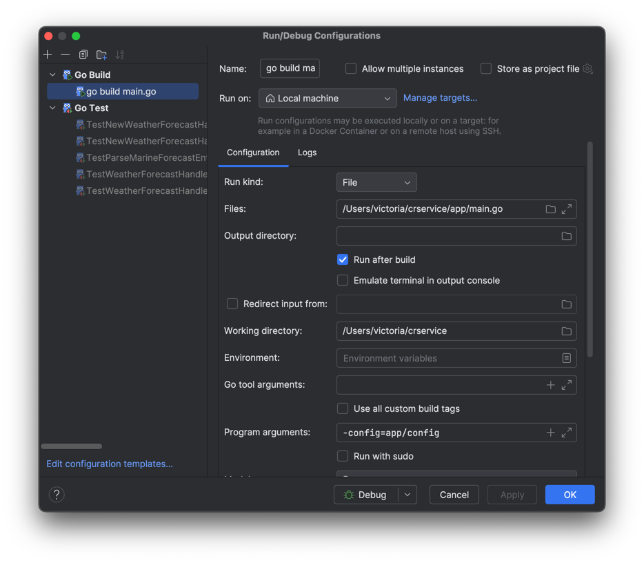

Please use the MakeFile for Build, lint
make deps -to install dependencies
make build  - to build code

You should be able to run the code using.
go run app/main.go -config=app/config

If using Goland which I use please use the config in this screenshot

If using Postman use the localhost url below:

localhost:8080/weatherforecast/marinewaveheight/?latitude=54.544587&longitude=10.227487

For GRPC call import the proto and use the url here:

localhost:50051

and message:
{
"latitude": "54.5",
"longitude": "10.20"
}
